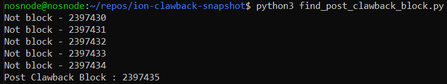

# ion-clawback-snapshot
This repo contains the base state export, derived balances, and a pivoted csv file with balance by wallet address of an [Osmosis](https://osmosis.zone/) snapshot at block height [2397435](https://www.mintscan.io/osmosis/blocks/2397435) - first block after clawback executed[^1] per [Prop #32](https://www.mintscan.io/osmosis/proposals/32).


To produce these files yourself for verification the process after cloning and navigating to this repo would be as follows using an Osmosis node[^2]:

### 1 - Find the first block after clawback
```
python3 find_post_clawback_block.py
```


### 2 - State Export
```
osmosisd export --height 2397435 &> state_export_2397435.json
```
⛔ Note the node needs to be stopped to run this cmd successfully and the output is being redirected to STDERR[^3] and needs to be captured with `&>`.

### 3 - Export Derive Balances
```
osmosisd export-derive-balances state_export_2397435.json derived_balances_2397435.json
```
### 4 - Python convert to CSV
*Needs Pandas, hence the virtual environment
```
python3 -m venv .venv
source .venv/bin/activate
python3 pip install -r requirements.txt
python3 derived_bal_json_to_csv.py
```
# Result has a total of 21293.999277 ION 
Figure someone IBCed out several hundred uION to result in the slightly less than 21,294 total supply


## ⚠ Module Accounts with Ion to exclude from analysis ⚠

Lockup    = osmo1njty28rqtpw6n59sjj4esw76enp4mg6g7cwrhc

Pool #2   = osmo1500hy75krs9e8t50aav6fahk8sxhajn9ctp40qwvvn8tcprkk6wszun4a5

Pool #11  = osmo1zka4v4c04jr74ludyls2lfzfttzx67qzd070xtnfq90yzyacgn9qv6vend
Pool #14  = osmo1kpf2xfutvfqfum9aj2juvjcjcxzp7k3le389v6ql6lurzcq0hausa6uyx8
Pool #18  = osmo17ff0mxg5j6xtuh7ma623ejcntuzuvpewu9dyjk00wkadh75au3qs0gp8pv
Pool #19  = osmo1d0elgsavwgez5xf0fdan3krzfjm5jkdtcgxzlvunu4jndycs8u8qzs5h33
Pool #26  = osmo1a6rvlkd2jw32mjf2pt78fte7f2hqu7gvr0yqsqek2c7anftrunkqqq798z
Pool #28  = osmo1hpfr8caa9swnqj2wapqwjfakqkfvdq70uvjv37pdst3xunsde2hqkz0na4
Pool #29  = osmo18yxeq5kpup4k47vhjgu8j4y8d82sna7sdtjlz7hkuphnqtsmh8asc9vgca
Pool #33  = osmo1pppq6lxkyrhh74npg87t2hgzqvamdck0u2qkycptdlczpx95h9tqn4c8d3
Pool #35  = osmo1p9pa7umdvry4u4338hgu4x5pkepnk9pcqddpg65zdj0k3a3ucjts85hj73
Pool #48  = osmo1r57khl30h7ewsqe0lkr4kk7m58nlsg2qjzgxzsjal2jec9q3xcnqshf4sn
Pool #50  = osmo1l5ehe7cqgf5fplxegqaukwygaz8g2h62yhdt06te6uem30l2j9mswf6qct
Pool #51  = osmo106vz3g36x84avkrrt2v602khu0t9lppptdd2gp0mr0l35pmqv5fqe2wmhj
Pool #55  = osmo14rjjpwlhg3vdqtuvjx7jkfnvas3uhhyak4r6pnewup00qm0thjmsstmrv2
Pool #56  = osmo1r32kkdc46p78k6lsaqld3dl7dvdquunue3w60amuylg8q945mqzqehqgcs
Pool #69  = osmo1ztk3sfcrdvv2lnmjzfad5qerkevp3y5ny8s3n5t8c94pxwu0putqw3dqtw
Pool #72  = osmo1hjkkjcc88t8mf2h4n2rzdxtdpmscv53ek33vs48jxk5x0d2uf9hs59teze
Pool #92  = osmo15eqya8as2ytwxzwfeyjs0xra4yxdeakp70397fzvhfa0vf0z3lmslnkzgv
Pool #108 = osmo1efs9dkdr9qtk85e69ah5nzng60wtz04yhh05vnq7l3vcvy38aj2snmr8r7
Pool #122 = osmo18pr2rasc9428jwr6t8hf4m50fgd35am4s6lr45yae0slmfzqukgq20jmsw
Pool #135 = osmo1k33jzr6syz8fs9jlsjerwum53ctu9nzkfdr3uy58ddt2tpsnsw0sl8ff3s
Pool #147 = osmo1dyvjg5eyr58e73fpnw3z6c7wz2h0wvarmpmvq0c60vawm8e6q70q44v94n
Pool #151 = osmo1f33v0n0kn6vtu7vkxuf2rm9dxncnwuga5825tzupc3t9umsgt0rsl6u29e 
Pool #177 = osmo1m4qg2yg542hp38yrdnp7wxhpm8j3agu78sg7f6lz0dzpmk4t4cysy9x5mj
Pool #194 = osmo1daztxlwd90kqt7yw7mvakhp9kjd34g250dywutq06nvlze2u6uhsuk26xw
Pool #211 = osmo132qw6zaztxfnjj3a2e20adm3xwzjrycqwcc048x6wpv0w00dgl7qvlln2p
Pool #264 = osmo13cslqv80p4uzx4cxjvpnrva68yac6z55yhafqau3k5vy6yw5027q2yx8ms
Pool #268 = osmo1gjfqv5vtwnm99dwac9v9ug4l9msyq9wejnatnvj35ex25ak2nrssh3pat9
Pool #254 = osmo19ffd2uz59gf0w594hpwxjgzrkt3c2vd70gzw6lhdtsz07hl2m7sqfky68k
Pool #255 = osmo10v35xj20k0jrfgs8p3lqt5gyga0wug3kkh4pq6xt3x4hqh5huvcssp04d3
Pool #280 = osmo1u6wc5hkhg50kxdn9l8pye6zt6jvh5czeej86r4c6segzt0sw6wnsn7rj2x
Pool #303 = osmo12huxa5wnwskf8mnmr096yzwyrehm970782j95h25uuxrxxz8wdpq7udusr
Pool #320 = osmo13u649up5fe79u2aq0d3rsl5x48lulu5yred75lcuw94dlugfxdqq39hz0s
Pool #323 = osmo1pul0yh6cr9wa6xghehfc8z8cx94krfm065v59r2py5clyqnfq7hq7yt77f
Pool #332 = osmo13nztwp3wht4k8zm6ztkczjqxyu74kvl8xjjfqssd7g2lwghzknhqn9gpek
Pool #344 = osmo17rujtwmvk8vp3uqq6xxkymk83n3qethhejuar7ayhyuupcsw66mqmg4k28
Pool #356 = osmo1szh2gzzsugx6e5vs7emkcrmcy87zg75jst8xemdp896v33u5f5eqt395ku
Pool #358 = osmo1a0ev3jr6fts7y09as95pryn59hzwfkaletpusfzctejjy0wqa47sxqgy3a
Pool #359 = osmo1m06zu73wfy99eaxhlzy7mcgwz6lfhs3whse0978wjk66s057h9yswfmgzf
Pool #362 = osmo1d7p44gdu45sp4jh4r5a8jppvvlrf3jd4synudv3kwa8lhz2clhzsnq04ed
Pool #380 = osmo1ejcrrmfxaphd6nf270r34467u2a407mewhq5g5cz6hdhzqs7nnxsvpthf9
Pool #391 = osmo14sxd3nugue3z44lh55cvn7uq8xzzzkgfknnuxtazr569jyymcqys2eykgs
Pool #395 = osmo16qzex7q0cpj3dflx79ycqvsujm0dt838lfjv9fjg80zna7jpn2ssn3cta4
Pool #399 = osmo1c2pg9y4evezv5twrpfecc78yslp467ea896zls960ptsre88c07qdpanaj
Pool #426 = osmo1r5v05r30s0v75py3n3lhd7sq5cdgkaltles5rk0cmgndrdq7ktxqcn64y8
Pool #437 = osmo1tz8jzsa8hlp3qc25l6wduxz3kyqvqa0l9sxwtqt5l9ur6rtqsrfsjk9rta
Pool #474 = osmo18vt7x9yuda579ssr668avfe8mlngrf255fx3re23340twmh3ujyqsfr3h8
Pool #476 = osmo157yhlzsnqxvrne3wdpukh7uca40l9mak875u44f9asufvwkldzzs7tpaal
Pool #545 = osmo1k4gj3utpx0s3pmtq7shmyhdq2dp605e03hcprvzvec7jq2ge2u7s4r0wp4
Pool #569 = osmo16dn4uk4xlqshzufy3f0as2pnvdpwqlwepp0m5qumwh2c4vgmp9jqaa0zsh
Pool #598 = osmo1s46juu2q7ets8tgqaytaaekfs5qu259tkex87ll068xsvfcf8uas6rkavc


[^1]: You might expect block 2383301 to have been the clawback block since [Prop #95](https://www.mintscan.io/osmosis/proposals/95) shows [2383300](https://www.mintscan.io/osmosis/blocks/2383300) as the upgrade height, but the clawback was coded to happen some hours after the v5.0.0 upgrade block.

[^2]: Osmosis [v6.0.0](https://github.com/osmosis-labs/osmosis/releases/tag/v6.0.0) release was used to produce the files in this repo.

[^3]: Osmosis [v5.0.0](https://github.com/osmosis-labs/osmosis/releases/tag/v5.0.0) contained an upgrade to the [Cosmos-SDK](https://github.com/cosmos/cosmos-sdk) version from [v0.42.9](https://github.com/cosmos/cosmos-sdk/releases/tag/v0.42.9) to [v0.44.3](https://github.com/cosmos/cosmos-sdk/releases/tag/v0.44.3) where it seems the `export` CLI command unexpectedly changed to stream to STDERR rather than STDOUT as it had been doing prior. 


